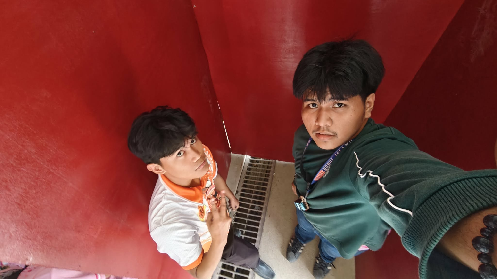
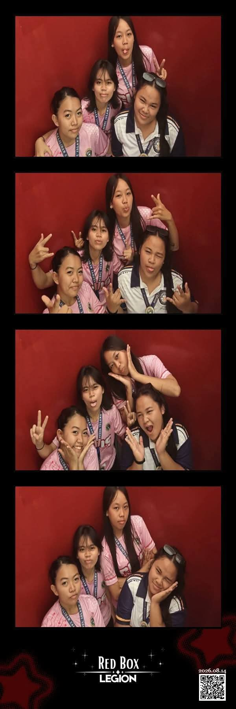
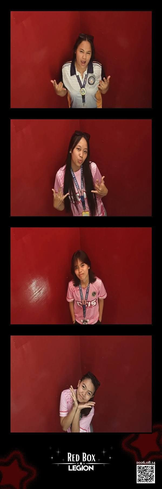
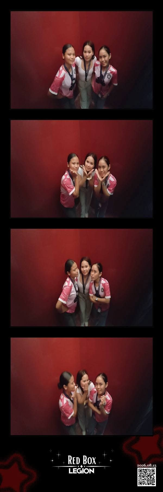

# RedBox Legion 📸

A fully offline, self-hosted web photobooth — built for live events. Deployed and used at a real event where it handled guest photo strips and generated actual sales.



## What it does

RedBox Legion turns a laptop + Android phone into a self-contained event photobooth: guests pose, take a strip, and get a QR code on the spot to download their photos on their own phone — no internet required, no cloud upload, everything runs locally over the laptop's own WiFi hotspot.

## Tech stack

- **Backend:** Flask (Python), served over self-signed HTTPS
- **Frontend:** vanilla HTML/CSS/JS, camera feed via `getUserMedia()`
- **Camera:** Android phone running DroidCam, connected via **USB** (not WiFi) to avoid bandwidth contention with guest phones on the same network
- **Printing:** strips render at true 2×6in, 300 DPI (600×1800px canvas), with per-template slot layouts measured from each frame PNG's alpha channel
- **Batch printing:** `make_batch_docx.mjs` (Node.js + `docx` npm package) lays out strips 5-per-page on landscape A4 for efficient printing and cutting
- **QR delivery:** each saved strip gets an offline-generated QR code (with date baked in) linking to a local download route, so guests grab their photos without needing internet

## Setup / running it

```bash
cd photobooth        # or wherever the project root is
python app.py
```

Then open the IP address that gets printed in the terminal (not `localhost` — the app is run via a real Flask server specifically so the QR codes encode a reachable LAN IP that guest phones can actually load).

**Camera setup:** install DroidCam on the booth phone, connect it to the laptop via **USB**, then select it from the camera dropdown in the browser UI.

## Notable fixes along the way

- Cropped out the baked-in black letterbox bars from the DroidCam feed
- Corrected a mirrored/flipped camera preview
- Worked around a restricted-network `npm install` and a DXA-vs-pixel unit bug in the batch-print script

## Status

Deployed and run live at a school event — guests used it, strips printed correctly, and it generated real sales. Fully offline for the duration of the event.

## Gallery

| | |
|---|---|
|  |  |
|  |  |

## Questions / issues

Message me directly if something's broken.
